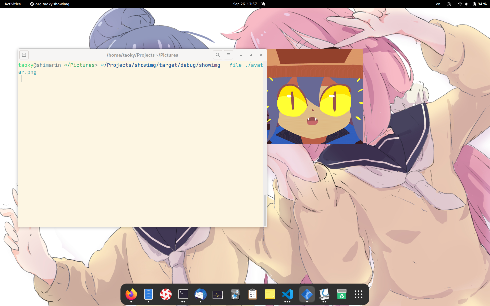
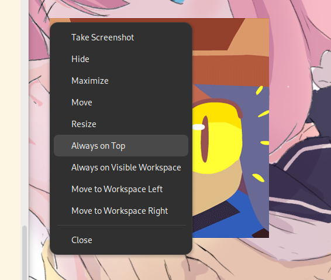

# showimg

A very simple GTK program to show a picture without window decoration in Linux (supports transparent PNG files). Written in gtk-rs.

Hint: Right click or press Alt + Space to activate mutter window menu in GNOME. You can set the window to be "Always on Top" there.

## Build

### Pre-build binaries & flatpak

You can download pre-build binaries or flatpak bundle from GitHub Releases.

The binary is compiled under Ubuntu 22.04, which shall work for all FHS-compliant distros after that, as long as you have installed GTK 4.4 or later.

If you prefer flatpak, just install with:

```shell
flatpak install --user ./moe.taoky.showimg.flatpak
```

### Cargo

```shell
cargo build --release
```

or

```shell
cargo install showimg-gtk
```

### Flatpak

```shell
flatpak-builder --install repo build-aux/moe.taoky.showimg.yaml --force-clean --user
```

## Usage

```shell
./showimg ./path/to/img
```

```console
$ ./showimg --help
showimg-gtk 0.2.0
Show a picture without window decoration in Linux desktop

USAGE:
    showimg-gtk [OPTIONS] [FILE]

ARGS:
    <FILE>    The image file to open. Empty value would open a file chooser dialog

OPTIONS:
    -h, --help                     Print help information
    -m, --mouse <MOUSE>            Controls how window reacts to mouse events [default: none]
                                   [possible values: none, drag, passthrough]
        --no-context-menu          Disable right-click context menu
        --no-maximize              Disable double-click to maximize
    -q, --quit-with <QUIT_WITH>    The accelerator to quit the application, "none" to disable.
                                   Syntax:
                                   https://gtk-rs.org/gtk4-rs/stable/latest/docs/gtk4/fn.accelerator_parse.html
                                   [default: q]
    -V, --version                  Print version information
```

Picture will be shown with their natural size. You could resize the window manually.

## Screenshot




